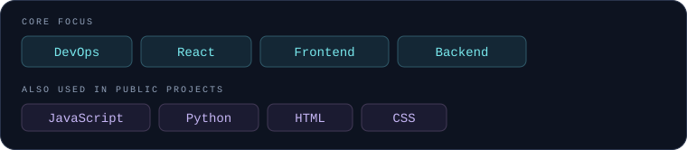
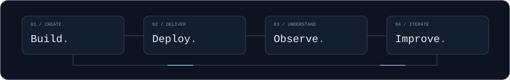

<p align="center">
  
</p>

<p align="center">
  <strong>Infrastructure mindset. Full-stack perspective.</strong><br />
  <sub>From React interfaces to backend services and the systems that keep them running.</sub>
</p>

<p align="center">
  <a href="https://github.com/Seeuagaen?tab=repositories">Explore my repositories ↗</a>
  &nbsp; · &nbsp;
  <a href="https://github.com/Seeuagaen/Portfolio">Portfolio ↗</a>
</p>

### 01 / About

I'm **Seeuagaen**, a **Middle DevOps Engineer** with experience across **frontend and backend development**. I work with **React** and enjoy connecting application development with operations.

```yaml
role: Middle DevOps Engineer
location: Astana, Kazakhstan

focus: [DevOps, Frontend, Backend]
frontend: [React, JavaScript, HTML, CSS]
backend: [Python, PHP, MySQL]

infrastructure:
  os: Windows
  containers: Docker
  web: Nginx
  ci_cd: [GitHub Actions, GitLab CI/CD]
  vcs: Git

principles:
  - automate repetitive work
  - keep deployments reproducible
  - understand the full delivery lifecycle

approach: build → test → deploy → observe → improve
mindset: infrastructure thinking · full-stack perspective
```

### 02 / Toolkit

<p>
  
</p>

### 03 / Selected projects

| Project | What it does | Stack |
| :--- | :--- | :--- |
| **[Face Recognition ↗](https://github.com/Seeuagaen/face-recognition)** | Face recognition project developed for my university diploma. | Python |
| **[Portfolio ↗](https://github.com/Seeuagaen/Portfolio)** | Personal portfolio created as an Erasmus web programming project. | JavaScript · HTML · CSS |
| **[Student Management ↗](https://github.com/Seeuagaen/linux-project)** | A terminal application for managing student records, with CSV persistence and formatted tables. | Python · PrettyTable |

### 04 / Engineering loop

<p align="center">
  
</p>

<p align="center">
  <sub>SEE U AGAIN / Seeuagaen</sub>
</p>
